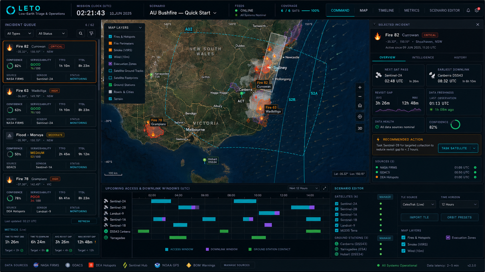

<div align="center">


<p align="center">
  <strong>Mission control for satellite emergency response.</strong><br/>
  Fuse live disaster feeds with satellite access windows, revisit timelines, and downlink planning.
</p>

<p align="center">
  <a href="https://leto-eta.vercel.app"></a>
  <a href="https://github.com/benajaero/leto/actions/workflows/ci.yml"></a>
  <a href="LICENSE"></a>
</p>



</div>

---

## What is LETO?

**LETO** is a browser-first mission control dashboard for satellite emergency response. It answers the critical question:

> *"Given my satellites and ground stations, which incident can I observe first — and how quickly can I get the data down?"*

Built for satellite imagery analysts, emergency coordinators, and field operators who need rapid triage under time pressure.

### Key Capabilities

| Feature | Description |
|---------|-------------|
| 🔥 **Live Feeds** | NASA FIRMS (fires), GDACS (floods/cyclones), NASA EONET (natural events), USGS (earthquakes) |
| 🛰️ **Orbit Propagation** | SGP4/TLE propagation for real satellites; circular orbit generator for synthetic constellations |
| 🗺️ **Access Windows** | AOI imaging passes, station contact windows, revisit gap analysis |
| ⏱️ **Time-to-Information** | TTFO (time to first observation) + TTDL (time to downlink) per incident |
| 📊 **Serviceability Scoring** | Weighted 0-100 score combining observation latency + downlink latency + gap coverage |
| 🎯 **Interactive Map** | Satellite basemap with ground tracks, footprints, AOI boundaries, incident markers |
| 📈 **Gantt Timeline** | Visual pass schedule with access windows, downlink windows, station contacts |
| ⚙️ **Scenario Editor** | Configure AOIs, satellites, stations, horizons, timesteps in real-time |

---

## Architecture

```
┌─────────────────────────────────────────────────────────────────┐
│                         DATA SOURCES                             │
│  NASA FIRMS ──►│                                               │
│  GDACS ───────►│  ┌─────────────┐    ┌─────────────────────┐  │
│  NASA EONET ──►├──►│  Ingestion  │───►│  Satellite Engine   │  │
│  USGS ────────►│  │   + Cache   │    │  (SGP4/Access calc) │  │
│                │  └─────────────┘    └─────────────────────┘  │
│                │                          │                     │
│                │                    ┌─────┴─────┐              │
│                │                    ▼           ▼              │
│                │              ┌─────────┐  ┌──────────┐       │
│                │              │ Tracks  │  │ Windows  │       │
│                │              │ Access  │  │ Revisit  │       │
│                │              └────┬────┘  └────┬─────┘       │
│                │                   └─────┬──────┘             │
│                │                         ▼                    │
│                │              ┌──────────────────┐            │
│                │              │  Incident Scores │            │
│                │              │   + Serviceability│            │
│                │              └──────────────────┘            │
└─────────────────────────────────────────────────────────────────┘
                              │
                              ▼
┌─────────────────────────────────────────────────────────────────┐
│                         UI LAYERS                                │
│  ┌──────────────┐  ┌──────────────┐  ┌──────────────────────┐  │
│  │Incident Queue│  │ Tactical Map │  │  Selected Incident   │  │
│  │  + Filters   │  │ + Layers     │  │  + Tabs + Metrics    │  │
│  └──────────────┘  └──────────────┘  └──────────────────────┘  │
│  ┌──────────────────────────────────────────────────────────┐  │
│  │           Gantt Timeline (Pass Schedule)                  │  │
│  └──────────────────────────────────────────────────────────┘  │
└─────────────────────────────────────────────────────────────────┘
```

---

## Quick Start

```bash
# Clone the repo
git clone https://github.com/benajaero/leto.git
cd leto

# Install dependencies
pnpm install

# Run development server
pnpm dev

# Run tests
pnpm test

# Build for production
pnpm build
```

### FIRMS API Key (Optional)

For live fire data from NASA FIRMS, get a free API key at [firms.modaps.eosdis.nasa.gov/api/map_key/](https://firms.modaps.eosdis.nasa.gov/api/map_key/) and paste it into LETO's settings panel. Without a key, LETO falls back to bundled sample data.

---

## Data Sources

| Source | Type | Latency | Auth |
|--------|------|---------|------|
| [NASA FIRMS](https://firms.modaps.eosdis.nasa.gov/) | Active fires (VIIRS/MODIS) | ~3 hours | Free API key |
| [GDACS](https://www.gdacs.org/) | Floods, cyclones, earthquakes | ~1 hour | None |
| [NASA EONET](https://eonet.gsfc.nasa.gov/) | Natural events (fires, storms, volcanoes) | ~1 hour | None |
| [USGS Earthquakes](https://earthquake.usgs.gov/) | M2.5+ earthquakes | Real-time | None |

> ⚠️ **Decision-support only.** Not a sole source for operational response. All data feeds have latency, coverage gaps, and correction cycles. The UI surfaces timestamps and source status for transparency.

---

## Tech Stack

- **Framework**: Next.js 14 (App Router, static export)
- **State**: Zustand (split stores: engine + UI)
- **Styling**: Tailwind CSS v3 (custom aerospace dark theme)
- **Orbits**: satellite.js (SGP4 propagation)
- **Maps**: Leaflet + react-leaflet (CartoDB Dark Matter tiles)
- **Testing**: Vitest
- **Deploy**: Vercel

---

## Roadmap

- [x] Core engine (SGP4, access windows, revisit)
- [x] Live data feeds (FIRMS, GDACS, EONET, USGS)
- [x] Interactive map with satellite basemap
- [x] Gantt timeline for pass scheduling
- [x] Scenario editor
- [x] Mobile-responsive layout
- [ ] 3D globe view (Cesium/Three.js)
- [ ] Weather overlay integration
- [ ] Multi-user collaboration
- [ ] Tasking request generation

---

## Contributing

See [`CONTRIBUTING.md`](CONTRIBUTING.md) for workflow, testing, and spec updates. By participating, you agree to the [`CODE_OF_CONDUCT.md`](CODE_OF_CONDUCT.md).

## License

Copyright 2026 Chukwudiebube Ebenezer Ajaero

Licensed under the Apache License, Version 2.0. See [LICENSE](LICENSE) for details.

## Attribution

- NASA FIRMS (Active Fire data)
- GDACS (Global Disaster Alert and Coordination System)
- NASA EONET (Earth Observatory Natural Event Tracker)
- USGS Earthquake Hazards Program
- CelesTrak (TLE data)
